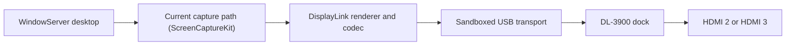

# DisplayLink Containment Research

Unofficial macOS audit and least-privilege build tooling for a **user-supplied**
DisplayLink Manager 16.2.39 package.

> [!IMPORTANT]
> This is not an open-source DisplayLink driver and it does not remove macOS's
> screen-observation disclosure. It creates a local, ad-hoc-signed containment
> build around DisplayLink's proprietary rendering executable.
> **This repository distributes no DisplayLink package, executable, firmware,
> resource, or generated app.**

## Why this exists

DisplayLink-driven ports on macOS work by receiving desktop pixels, encoding
them, and sending them over USB to the dock. That necessarily causes macOS to
report that the screen is being observed. Apple documents that screen sharing
or mirroring to an external display can produce this notice, and DisplayLink
documents Screen Recording permission as part of its macOS graphics path.

The official 16.2.39 package was inspected because its main process also had a
general outbound-network entitlement. The audit found no telemetry collector,
pixel-upload endpoint, screenshot writer, analytics SDK, crash uploader, or
updater, and found no evidence that screen pixels were being exfiltrated. That
is evidence, not proof of every behavior in an opaque proprietary executable.

This project takes a narrower and testable approach: pin every input byte, keep
macOS App Sandbox enabled, remove ordinary client/server network permission,
ad-hoc sign the result, and verify the resulting entitlement boundary.

The source-only publication pipeline was exercised against the pinned installer
and reproduced the complete, previously hardware-tested Local app tree
byte-for-byte.

For a normal macOS application experience, the repository can place the
single-process experimental Core profile inside a source-authored controller
named **DisplayLink Contained**. The controller is a real, Finder-launchable
`.app` with its own icon and installs under `~/Applications`. It adds no second
status item: the nested DisplayLink engine supplies the sole menu-bar icon and
its existing UI. Opening the controller again activates that engine. Selecting
**Quit** from the DisplayLink menu starts supervised shutdown, and the
controller exits only after it proves the bound Core process is gone. See
[Contained application controller](#contained-application-controller) for the
important trust and qualification limits.



ScreenCaptureKit is the current path; the binary also contains legacy
CGDisplayStream and AVCapture screen-input fallbacks. The screen-observation
state applies wherever the process receives desktop pixels. Removing every such
path also removes DisplayLink video output.

## Hardware actually tested

Compatibility claims are intentionally narrow:

| Item | Observed configuration |
| --- | --- |
| Dock | [Plugable UD-3900PDZ](https://plugable.com/products/ud-3900pdz/) |
| USB identity | `17e9:4323` |
| DisplayLink family | DL-3900 / Ella |
| Mac | MacBook Pro with Apple M3 Pro |
| macOS | macOS 27 beta, tested 2026-08-11 |
| Confirmed Local output | One warm-connected monitor at 1920×1080, 60 Hz |
| Confirmed Contained/Core output | One warm-connected external display at 1920×1080, 144 Hz |
| Confirmed profiles | `DisplayLink Local` (four processes) and `DisplayLink Contained` with its one-process Core engine |
| Contained lifecycle | Two clean dock-connected launch/reopen/quit cycles; reopen reused the same PIDs and each quit ended at zero DisplayLink processes with both legacy helper labels absent |
| Network observation | No TCP or UDP socket owned by the main or XPC process during the observation period |
| Monitor/port record | macOS reported `Z27H` during the Contained run; whether HDMI 2 or HDMI 3 was used was not recorded |
| Observation duration | Brief controlled sessions, not a long-duration stability run |

The UD-3900PDZ uses native DisplayPort Alt Mode for **HDMI 1** and DisplayLink
USB graphics for **HDMI 2 and HDMI 3**. HDMI 1 does not need this project or
Screen Recording permission.

“Warm-connected” means the dock and monitor were already attached when the
derived app was launched. Not tested: other Plugable docks, other DisplayLink
chips or revisions, both DisplayLink outputs simultaneously, cold boot,
extended hotplug testing, sleep/wake, logout/login, Intel Macs, or long-duration
stability. A matching brand name, USB VID:PID, or chipset is not by itself a
compatibility guarantee.

Both profiles were observed on only the exact configuration above. The final
Contained run verified an online, active, non-built-in 1920×1080 display at
144 Hz while exactly the controller and its nested Core process were running.
DisplayLink's own launch log reported USB `17e9:4323` during that run. This is a
narrow functional observation, not a general compatibility or stability claim.
The lifecycle harness exercised graceful nested-engine termination and the
controller's `SIGTERM` path. The retained vendor UI provides the visible
menu-bar Quit command and routes it through nested application termination; the
final accessory-app status item itself was not clicked by UI automation.

## Profiles

### DisplayLink Local — tested profile

This is the profile used for the original 60 Hz hardware observation. It
retains the official app's four executables:

- the main USB/rendering process;
- the local display-control XPC service;
- the crash-restart helper; and
- the login helper.

All four remain sandboxed. Direct client/server network entitlements are absent
from every executable, and the DisplayLink application-group entitlement is
removed. Because the code is ad-hoc signed, the XPC service's vendor Team-ID
check rejects some control requests; brightness, contrast, status, mirror, or
flip controls may be unavailable even though the tested display came online.

The Local display name contains “No Network” to preserve the exact artifact
used in the hardware test. That is shorthand for **no direct client/server
network entitlement**, not a claim of absolute network or IPC isolation.

### DisplayLink Core — experimental profile

Core removes the XPC, crash-restart, and login-helper executables, both embedded
LaunchAgents, App Intents metadata, and the inbound custom URL handler. The one
remaining executable receives only App Sandbox, USB access, and lookup access
to Apple's local backlight service.

Core passes source, structure, signature, and entitlement verification. Its
first A/B launch was blocked by a fresh Screen Recording identity, but a later
authorized run completed the narrow Contained hardware and lifecycle test in
the table above. Core remains experimental: cold boot, sleep/wake, hotplug,
long-duration stability, Intel Macs, and a second simultaneous DisplayLink
output are still unqualified.

### Contained application controller

`DisplayLink Contained.app` packages an exact, verified Core app as:

```text
Contents/Helpers/DisplayLink Core Engine.app
```

The outer controller is independently written Objective-C code included in
this repository. It provides the recognizable Finder application, launches and
activates the nested engine, and supervises its lifecycle. It deliberately has
no separate menu-bar or Dock item; the existing DisplayLink menu-bar icon is the
only status item. The controller starts the engine with automatic login and
crash-restart launch disabled and does not contain or install a login item,
LaunchAgent, XPC helper, or crash helper.

On normal Quit from the nested DisplayLink menu, the controller:

1. binds the launched PID to its process start time and exact canonical path;
2. requests graceful termination, then escalates only against that revalidated
   Core process;
3. treats PID reuse, path changes, and enumeration uncertainty as failures
   instead of targeting an ambiguous process;
4. refuses completion if a known DisplayLink helper registration or a foreign
   DisplayLink main/helper process is present; and
5. exits only after repeated scans prove that the bound process and every exact
   nested Core process are gone.

It does not use broad process-name termination. If ownership cannot be proven,
another DisplayLink variant is present, or shutdown cannot be confirmed, it
fails closed instead of touching an unrelated process or reporting a complete
quit. Registration checks are read-only: the controller never unregisters,
unloads, or signals an official or foreign DisplayLink background job.

The controller is intentionally **not sandboxed** because it must inspect and
signal its sibling Core process. It has no entitlements; source and binary gates
reject reviewed direct networking APIs, networking classes, and common
network/web framework links. That is a reviewable source property, not an
operating-system network denial. The nested one-process Core engine remains
sandboxed and has no direct client/server network entitlements.

The controller neither captures the screen nor grants privacy access. macOS
Screen Recording authorization and the observation indicator still apply to
the nested DisplayLink engine. The controller has passed source/build boundary
checks and the two narrow dock-connected lifecycle cycles described above. The
failure-path test also proved that stale foreign DisplayLink jobs are detected
and block a false successful quit. This is not broad hardware or long-duration
qualification.

## Requirements

- macOS 14, 15, 26, or 27 beta, as listed for DisplayLink Manager 16.2.39 in
  [Synaptics' release notes](https://www.synaptics.com/sites/default/files/release_notes/2026-07/DisplayLink%20Manager%20Graphics%20Connectivity16.2-Release%20Notes.txt).
  This derivative was tested only on macOS 27 beta.
- Xcode Command Line Tools (`xcode-select --install`)
- The official **DisplayLink Manager 16.2.39** macOS installer, obtained by you
  from [Synaptics' official download page](https://www.synaptics.com/products/displaylink-graphics/downloads/macos)
- A DisplayLink-equipped dock or adapter

Only this pinned installer is accepted:

```text
SHA-256  fd9eafab9542e592baa39984ed4e87e64e89f3de6b9a4429ab13a2334a7538e6
Version  16.2.39
```

A later package is rejected intentionally. New releases require a new audit and
manifest; do not bypass the integrity gate.

> [!WARNING]
> The vendor license included with the package restricts modification, reverse
> engineering, derivative works, and distribution except where the license or
> applicable law permits. Review that license before running these tools. Never
> redistribute the generated app. See [third-party notices](THIRD_PARTY_NOTICES.md).

## Build and install the contained application

Clone the source and run its source-only checks:

```sh
git clone https://github.com/durhamaustin9/DisplayLink-Drivers-Reconstruct.git
cd DisplayLink-Drivers-Reconstruct
make test
```

Build from the official package you downloaded:

```sh
make integration-contained PKG="/path/to/DisplayLink+Manager+Graphics+Connectivity16.2-EXE.pkg"
make install-contained
make open-contained
```

This process:

1. verifies the outer installer's SHA-256;
2. expands it into an ignored local work directory without installing it;
3. verifies all 32 expected application files against the pinned manifest;
4. creates the one-process, direct-network-restricted Core derivative under
   `build/`;
5. ad-hoc signs it with hardened runtime;
6. embeds the exact verified Core tree in the universal, source-built
   controller; and
7. verifies the inventories, unchanged resource hashes, architecture payloads,
   signing identities, entitlements, controller identity, and nesting boundary.

The build and installed results are:

```text
build/DisplayLink Contained.app
~/Applications/DisplayLink Contained.app
```

The installer verifies before and after an exclusive, atomic placement and
refuses to overwrite an existing destination. It does not copy a generated app
into this repository or make it redistributable.

Quit and uninstall the official DisplayLink Manager, or unregister its
background items with the vendor's supported removal flow, before launching the
result. Do the same for every Local or other derived variant. They cannot safely
coexist because they share vendor identities, helper labels, privacy state, and
the same USB device. A merely dormant XPC or crash-restart registration can wake
when Core attempts an XPC lookup. The controller therefore refuses to start or
report a complete quit while either known helper registration or a foreign
DisplayLink process remains; it never adopts or terminates a foreign path.

```sh
make open-contained
```

You can also open **DisplayLink Contained** from `~/Applications` in
Finder. Reopening it while it is running activates the nested engine. Use the
single DisplayLink icon in the macOS menu bar for its UI and normal **Quit**
command; the outer controller remains visually unobtrusive while it supervises
the engine.

In **System Settings → Privacy & Security → Screen & System Audio Recording**,
authorize the nested **DisplayLink Core Engine** (its visible privacy label may
be **DisplayLink Core (USB Only)**) when macOS asks, then reopen the
contained application if required. Do not grant Screen Recording permission to
the outer controller; it does not need it. This permission is necessary for
HDMI 2/3 output. macOS continues to classify and disclose the nested engine as
screen capture while frames are delivered; the exact menu-bar, notification,
and lock-screen UI varies by macOS release.

The builder never installs a package, writes to `/Library`, loads a kernel
extension, changes System Integrity Protection, or grants a privacy permission.
The contained controller passes automatic-start and crash-restart-disabled
arguments. Its Core engine contains no helper executable, LaunchAgent, login
item, or App Intents metadata. Do not launch the nested app directly, because
doing so bypasses controller ownership and complete-quit verification.

## Build the standalone tested Local profile

To reproduce only the artifact used in the limited hardware observation:

```sh
make integration-local PKG="/path/to/DisplayLink+Manager+Graphics+Connectivity16.2-EXE.pkg"
open "build/DisplayLink Local.app"
```

The standalone result is `build/DisplayLink Local.app`. Quit every other
DisplayLink variant before launching it. It retains vendor app-scoped
login/background services and does not provide the controller's complete-quit
supervision.

## Build the experimental Core profile

After `make prepare` or any integration build has created the verified local
source tree:

```sh
make core
make verify-core
```

The result is `build/DisplayLink Core.app`. It has a different ad-hoc identity
and therefore requires its own explicit Screen Recording authorization. It
completed the narrow test above only after that authorization; treat it as an
experiment outside the recorded configuration and keep Local available for
rollback.

## Quit, update, or uninstall the contained application

The official app, Local, Core, and nested Core engine share vendor identities
and helper labels that can create TCC, LaunchServices, and ServiceManagement
collisions. Run exactly one variant at a time. Uninstall or use the owning
variant's supported unregister flow for any background item before opening
Contained; killing a helper does not remove its persistent registration.

1. Choose **Quit** from the sole DisplayLink menu-bar item and allow the
   controller to finish its zero-process confirmation before moving or replacing
   the app.
2. If normal shutdown reports a failure, do not use `killall`, `pkill`, or a
   bundle-identifier-only command. In Activity Monitor, inspect **Open Files and
   Ports** or the executable path and stop only processes rooted under the exact
   installed `DisplayLink Contained.app/Contents/Helpers/DisplayLink Core
   Engine.app` path. If the failure names a foreign DisplayLink helper, remove it
   through the app that registered it rather than allowing Contained to touch
   that process. Rebooting is the safest fallback when ownership is ambiguous.
3. In **System Settings → General → Login Items & Extensions**, confirm that no
   DisplayLink background item from another installation remains enabled. The
   controller itself has no automatic login start and does not change this
   system setting.
4. In **Privacy & Security → Screen & System Audio Recording**, revoke the
   nested engine's permission if you no longer want it authorized.
5. Move `~/Applications/DisplayLink Contained.app` to Trash. Remove the
   generated apps under `build/` and prepared `.work/` tree only after confirming
   you do not need another local build.

For an update, quit completely, move the existing installed controller aside or
to Trash, audit/build the newly pinned input, and run `make install-contained`
again. The installer intentionally refuses to overwrite. Do not replace the
outer app while any nested process is running, and do not copy a new nested
engine into an existing signed controller.

Normal menu Quit, application termination, `SIGTERM`, and `SIGINT` are
supervised. No application can guarantee cleanup after the controller receives
`SIGKILL`, a system crash, sudden power loss, or corruption severe enough to
prevent it from running; use the exact-path check or reboot fallback before
reopening.

These steps do not uninstall or delete an official DisplayLink installation.

## Rebuilding

The scripts refuse to overwrite an existing source tree or output. This is a
safety feature. Move the prior `.work/` or `build/` directory somewhere outside
the repository, or remove the exact directory yourself after confirming it
contains no files you need.

Never upload either directory. Both are ignored, and `make test` rejects tracked
vendor or generated artifacts.

## Security properties and limits

| Property | What is established |
| --- | --- |
| Input provenance | Exact outer package and 32 inner file hashes are pinned |
| Direct IP sockets | App Sandbox has no client/server network entitlement |
| Controller | Original, unsandboxed lifecycle code with no entitlements; reviewed direct networking APIs/classes and explicit network/web frameworks are rejected, but this is not an OS-enforced network denial |
| USB | Explicitly retained for the DisplayLink transport |
| Vendor trust | Removed; the result is ad-hoc signed and not notarized |
| Screen access | Still required and disclosed by macOS |
| Vendor code transparency | Not achieved; the main renderer remains proprietary |
| Local storage | Sandboxed processes can still write their private containers |
| Dock trust | Proprietary firmware remains and necessarily receives frame data over USB; it was not audited |
| Telemetry claim | No static collector/upload path found, but not exhaustively provable |
| Distribution | Generated apps and vendor materials must not be published |

See [the audit summary](docs/AUDIT-SUMMARY.md), [security policy](SECURITY.md),
[clean-room research design](docs/CLEAN-ROOM-DESIGN.md), and
[diagnostic tools](tools/README.md) for details.

## Why the notice cannot be safely hidden

Apple exposes USB device communication through DriverKit/USBDriverKit, but no
public third-party Display DriverKit family publishes a host framebuffer for a
DL-3900. The supported userspace pixel source is ScreenCaptureKit, which asks
for Screen Recording permission. The old IOFramebuffer kernel route is
deprecated, is not intended for third-party display drivers, and would require
weaker security settings on Apple silicon.

Using private frameworks or a legacy kernel extension to conceal the indicator
would trade away security and stability to bypass a privacy safeguard. This
project will not implement that.

If you require no observation state, use the UD-3900PDZ's HDMI 1 port, a direct
USB-C/DisplayPort/HDMI connection, or a native Thunderbolt/USB4 display dock.

References:

- [Apple ScreenCaptureKit](https://developer.apple.com/documentation/screencapturekit)
- [Apple: If you see an alert that your screen is being observed](https://support.apple.com/en-us/120315)
- [DisplayLink macOS Screen Recording explanation](https://support.displaylink.com/knowledgebase/articles/2008685-macos-sonoma-14-screen-recording-permission)
- [Plugable UD-3900PDZ display-output technologies](https://kb.plugable.com/en_US/docking-stations/what-technology-drives-each-of-the-displays-outputs-within-the-ud-3900pdz)

## Legal and project status

The DisplayLink license included with the audited package restricts copying,
modification, reverse engineering, derivative works, and distribution except as
the license or applicable law permits. Review it yourself before using these
tools. This repository's MIT License covers only original repository material
and grants no rights in third-party software. See
[THIRD_PARTY_NOTICES.md](THIRD_PARTY_NOTICES.md).

This project is experimental, unofficial, and not production-ready. It is not
affiliated with or endorsed by Synaptics, DisplayLink, Plugable, or Apple.
