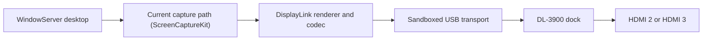

# DisplayLink Local Containment Research

Unofficial macOS audit and least-privilege build tooling for a **user-supplied**
DisplayLink Manager 16.2.39 package.

> [!IMPORTANT]
> This is not an open-source DisplayLink driver and it does not remove macOS's
> screen-observation disclosure. It creates a local, ad-hoc-signed containment
> build around DisplayLink's proprietary rendering executable.
> **This repository distributes no DisplayLink package, executable, firmware,
> resource, or generated app.**

## Why this exists

DisplayLink-driven ports on macOS work by receiving desktop pixels, encoding
them, and sending them over USB to the dock. That necessarily causes macOS to
report that the screen is being observed. Apple documents that screen sharing
or mirroring to an external display can produce this notice, and DisplayLink
documents Screen Recording permission as part of its macOS graphics path.

The official 16.2.39 package was inspected because its main process also had a
general outbound-network entitlement. The audit found no telemetry collector,
pixel-upload endpoint, screenshot writer, analytics SDK, crash uploader, or
updater, and found no evidence that screen pixels were being exfiltrated. That
is evidence, not proof of every behavior in an opaque proprietary executable.

This project takes a narrower and testable approach: pin every input byte, keep
macOS App Sandbox enabled, remove ordinary client/server network permission,
ad-hoc sign the result, and verify the resulting entitlement boundary.

The source-only publication pipeline was exercised against the pinned installer
and reproduced the complete, previously hardware-tested Local app tree
byte-for-byte.



ScreenCaptureKit is the current path; the binary also contains legacy
CGDisplayStream and AVCapture screen-input fallbacks. The screen-observation
state applies wherever the process receives desktop pixels. Removing every such
path also removes DisplayLink video output.

## Hardware actually tested

Compatibility claims are intentionally narrow:

| Item | Observed configuration |
| --- | --- |
| Dock | [Plugable UD-3900PDZ](https://plugable.com/products/ud-3900pdz/) |
| USB identity | `17e9:4323` |
| DisplayLink family | DL-3900 / Ella |
| Mac | MacBook Pro with Apple M3 Pro |
| macOS | macOS 27 beta, tested 2026-08-11 |
| Confirmed DisplayLink output | One warm-connected monitor at 1920×1080, 60 Hz |
| Confirmed profile | `DisplayLink Local` (four sandboxed processes) |
| Network observation | No TCP or UDP socket owned by the main or XPC process during the observation period |
| Monitor/port record | Monitor model and whether HDMI 2 or HDMI 3 was used were not recorded |
| Observation duration | A brief controlled session; exact duration was not recorded |

The UD-3900PDZ uses native DisplayPort Alt Mode for **HDMI 1** and DisplayLink
USB graphics for **HDMI 2 and HDMI 3**. HDMI 1 does not need this project or
Screen Recording permission.

“Warm-connected” means the dock and monitor were already attached when the
derived app was launched. Not tested: other Plugable docks, other DisplayLink
chips or revisions, both DisplayLink outputs simultaneously, cold boot,
extended hotplug testing, sleep/wake, logout/login, Intel Macs, or long-duration
stability. A matching brand name, USB VID:PID, or chipset is not by itself a
compatibility guarantee.

## Profiles

### DisplayLink Local — tested profile

This is the default and the only profile that completed the limited hardware
test described above. It retains the official app's four executables:

- the main USB/rendering process;
- the local display-control XPC service;
- the crash-restart helper; and
- the login helper.

All four remain sandboxed. Direct client/server network entitlements are absent
from every executable, and the DisplayLink application-group entitlement is
removed. Because the code is ad-hoc signed, the XPC service's vendor Team-ID
check rejects some control requests; brightness, contrast, status, mirror, or
flip controls may be unavailable even though the tested display came online.

### DisplayLink Core — experimental profile

Core removes the XPC, crash-restart, and login-helper executables, both embedded
LaunchAgents, App Intents metadata, and the inbound custom URL handler. The one
remaining executable receives only App Sandbox, USB access, and lookup access
to Apple's local backlight service.

Core passes source, structure, signature, and entitlement verification, but is
**not hardware-qualified yet**. Its first A/B launch had a new ad-hoc code
identity, so macOS had not authorized it for Screen Recording; the harness
rolled back to Local. Do not infer that Core works on this dock until a separate
permission grant and hardware qualification are completed.

The generated app's display name contains “No Network” to preserve the exact
artifact used in the hardware test. That is shorthand for **no direct
client/server network entitlement**, not a claim of absolute network or IPC
isolation.

## Requirements

- macOS 14, 15, 26, or 27 beta, as listed for DisplayLink Manager 16.2.39 in
  [Synaptics' release notes](https://www.synaptics.com/sites/default/files/release_notes/2026-07/DisplayLink%20Manager%20Graphics%20Connectivity16.2-Release%20Notes.txt).
  This derivative was tested only on macOS 27 beta.
- Xcode Command Line Tools (`xcode-select --install`)
- The official **DisplayLink Manager 16.2.39** macOS installer, obtained by you
  from [Synaptics' official download page](https://www.synaptics.com/products/displaylink-graphics/downloads/macos)
- A DisplayLink-equipped dock or adapter

Only this pinned installer is accepted:

```text
SHA-256  fd9eafab9542e592baa39984ed4e87e64e89f3de6b9a4429ab13a2334a7538e6
Version  16.2.39
```

A later package is rejected intentionally. New releases require a new audit and
manifest; do not bypass the integrity gate.

> [!WARNING]
> The vendor license included with the package restricts modification, reverse
> engineering, derivative works, and distribution except where the license or
> applicable law permits. Review that license before running these tools. Never
> redistribute the generated app. See [third-party notices](THIRD_PARTY_NOTICES.md).

## Build the tested Local profile

Clone the source and run its source-only checks:

```sh
git clone https://github.com/durhamaustin9/DisplayLink-Drivers-Reconstruct.git
cd DisplayLink-Drivers-Reconstruct
make test
```

Build from the official package you downloaded:

```sh
make integration-local PKG="/path/to/DisplayLink+Manager+Graphics+Connectivity16.2-EXE.pkg"
```

This process:

1. verifies the outer installer's SHA-256;
2. expands it into an ignored local work directory without installing it;
3. verifies all 32 expected application files against the pinned manifest;
4. creates the direct-network-restricted derivative under `build/`;
5. ad-hoc signs each executable with hardened runtime; and
6. verifies the exact file inventory, unchanged resource hashes, both
   architecture payloads, signing identity, and per-architecture entitlements.

The result is:

```text
build/DisplayLink Local.app
```

Quit any other DisplayLink Manager instance before launching the result. Never
run the vendor app and a derived app simultaneously because both can contend for
the same USB device.

```sh
open "build/DisplayLink Local.app"
```

In **System Settings → Privacy & Security → Screen & System Audio Recording**,
enable **DisplayLink Local (No Network)** when macOS asks, then reopen it if
required. This permission is necessary for HDMI 2/3 output. macOS continues to
classify and disclose this as screen capture while frames are delivered; the
exact menu-bar, notification, and lock-screen UI varies by macOS release.

The builder never installs a package, writes to `/Library`, loads a kernel
extension, changes System Integrity Protection, or grants a privacy permission.
Launching Local can, however, register the retained app-scoped login/background
services with macOS.

## Build the experimental Core profile

After `make prepare` or any integration build has created the verified local
source tree:

```sh
make core
make verify-core
```

The result is `build/DisplayLink Core.app`. It has a different ad-hoc identity
and therefore requires its own explicit Screen Recording authorization. Treat
it as an experiment and keep Local available for rollback.

## Stop and remove a generated app

The official app, Local, and Core retain the bundle identifier
`com.displaylink.DisplayLinkUserAgent`. This can create TCC, LaunchServices, and
background-item identity collisions. Run exactly one variant at a time.

1. Quit the running variant from its menu-bar item. If needed, use Activity
   Monitor to stop only the `DisplayLinkUserAgent` and associated helpers you
   just launched.
2. In **System Settings → General → Login Items & Extensions**, disable any
   DisplayLink Local background/login item registered by the test.
3. In **Privacy & Security → Screen & System Audio Recording**, revoke the
   generated app's permission if you no longer want it authorized.
4. Move the generated app under `build/` to Trash. The source under `.work/`
   can also be removed after you confirm you do not need it for another build.

These steps do not uninstall or delete an official DisplayLink installation.

## Rebuilding

The scripts refuse to overwrite an existing source tree or output. This is a
safety feature. Move the prior `.work/` or `build/` directory somewhere outside
the repository, or remove the exact directory yourself after confirming it
contains no files you need.

Never upload either directory. Both are ignored, and `make test` rejects tracked
vendor or generated artifacts.

## Security properties and limits

| Property | What is established |
| --- | --- |
| Input provenance | Exact outer package and 32 inner file hashes are pinned |
| Direct IP sockets | App Sandbox has no client/server network entitlement |
| USB | Explicitly retained for the DisplayLink transport |
| Vendor trust | Removed; the result is ad-hoc signed and not notarized |
| Screen access | Still required and disclosed by macOS |
| Vendor code transparency | Not achieved; the main renderer remains proprietary |
| Local storage | Sandboxed processes can still write their private containers |
| Dock trust | Proprietary firmware remains and necessarily receives frame data over USB; it was not audited |
| Telemetry claim | No static collector/upload path found, but not exhaustively provable |
| Distribution | Generated apps and vendor materials must not be published |

See [the audit summary](docs/AUDIT-SUMMARY.md), [security policy](SECURITY.md),
[clean-room research design](docs/CLEAN-ROOM-DESIGN.md), and
[diagnostic tools](tools/README.md) for details.

## Why the notice cannot be safely hidden

Apple exposes USB device communication through DriverKit/USBDriverKit, but no
public third-party Display DriverKit family publishes a host framebuffer for a
DL-3900. The supported userspace pixel source is ScreenCaptureKit, which asks
for Screen Recording permission. The old IOFramebuffer kernel route is
deprecated, is not intended for third-party display drivers, and would require
weaker security settings on Apple silicon.

Using private frameworks or a legacy kernel extension to conceal the indicator
would trade away security and stability to bypass a privacy safeguard. This
project will not implement that.

If you require no observation state, use the UD-3900PDZ's HDMI 1 port, a direct
USB-C/DisplayPort/HDMI connection, or a native Thunderbolt/USB4 display dock.

References:

- [Apple ScreenCaptureKit](https://developer.apple.com/documentation/screencapturekit)
- [Apple: If you see an alert that your screen is being observed](https://support.apple.com/en-us/120315)
- [DisplayLink macOS Screen Recording explanation](https://support.displaylink.com/knowledgebase/articles/2008685-macos-sonoma-14-screen-recording-permission)
- [Plugable UD-3900PDZ display-output technologies](https://kb.plugable.com/en_US/docking-stations/what-technology-drives-each-of-the-displays-outputs-within-the-ud-3900pdz)

## Legal and project status

The DisplayLink license included with the audited package restricts copying,
modification, reverse engineering, derivative works, and distribution except as
the license or applicable law permits. Review it yourself before using these
tools. This repository's MIT License covers only original repository material
and grants no rights in third-party software. See
[THIRD_PARTY_NOTICES.md](THIRD_PARTY_NOTICES.md).

This project is experimental, unofficial, and not production-ready. It is not
affiliated with or endorsed by Synaptics, DisplayLink, Plugable, or Apple.
